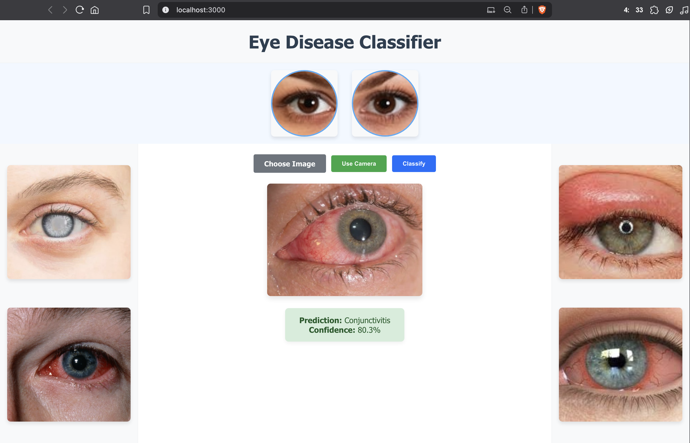
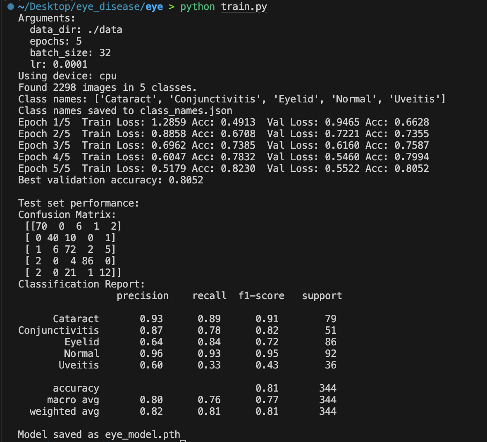

# Eye Disease Classification System

A deep learning application that classifies various eye conditions including Cataract, Conjunctivitis, Eyelid disorders, Normal eyes, and Uveitis using computer vision and neural networks.

## Technologies Used

### Backend
- **Python** with **PyTorch** for deep learning (CNN)
- **Flask** API for serving predictions
- **NumPy** and **PIL** for image processing
- **scikit-learn** for model evaluation

### Frontend
- **React.js** with responsive design
- Camera integration for real-time diagnosis
- Drag-and-drop image upload capability

## Features

- **Real-time classification** of eye diseases from images
- **High accuracy** convolutional neural network model
- **User-friendly interface** for medical professionals and patients
- **Detailed results** with confidence scores

## Documentation

- [Backend Documentation](backend/readme.md) - Details about the model architecture, API and usage
- [Frontend Documentation](frontend/README.md) - UI components and usage instructions

---

## UI Preview

*Main dashboard with upload and camera options*

*Example of classification results with confidence score*
